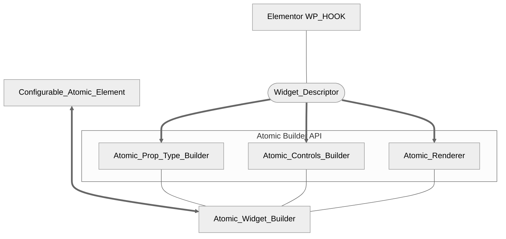

# Atomic Builder API

```mermaid
---
config:
    theme: neutral
---
graph
    hook@{ shape§: das, label: Elementor WP_HOOK}
    at[Configurable_Atomic_Element]
    wb[Atomic_Widget_Builder]
    subgraph Atomic Builder API
    pb[Atomic_Prop_Type_Builder]
    cb[Atomic_Controls_Builder]
    ar[Atomic_Renderer]
    end
    d([Widget_Descriptor])

    hook <=== d

    at <===> wb

    pb --- wb
    cb --- wb
    ar --- wb

    d ==> pb
    d ==>cb
    d ==> ar
```
