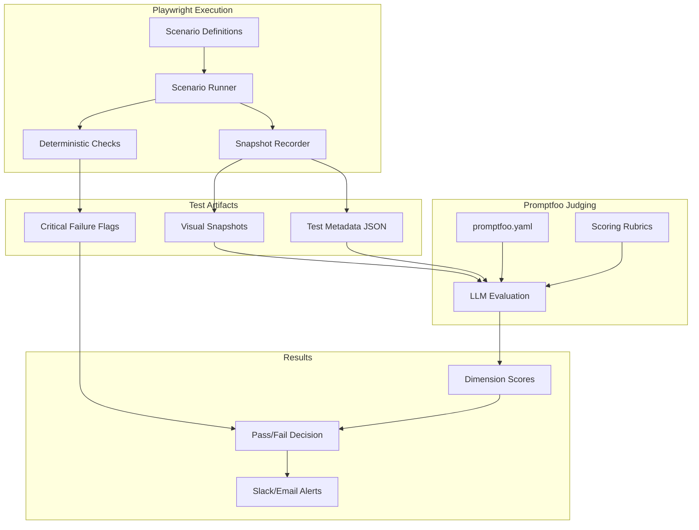
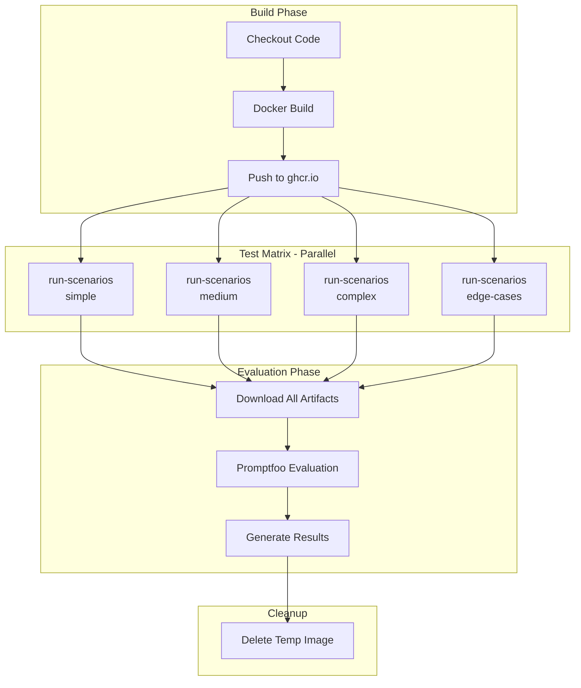

<!-- 0bbec0bc-0831-4740-b8bd-e86f70044e94 -->
---
todos:
  - id: "foundation-structure"
    content: "Create tests/llm-quality/ directory structure and TypeScript types"
    status: pending
  - id: "playwright-config"
    content: "Create playwright.config.ts for scenario execution (separate from main tests)"
    status: pending
  - id: "scenario-fixture"
    content: "Implement scenario fixture extending parallelTest with Angie helpers"
    status: pending
  - id: "base-scenario"
    content: "Create BaseScenario class with chat interaction and wait patterns"
    status: pending
  - id: "snapshot-recorder"
    content: "Build SnapshotRecorder to capture screenshots + metadata JSON"
    status: pending
  - id: "deterministic-checks"
    content: "Implement critical failure detection (empty canvas, errors, security)"
    status: pending
  - id: "sample-scenario-medium"
    content: "Create medium complexity scenario (hero section from wiki example)"
    status: pending
  - id: "promptfoo-setup"
    content: "Install promptfoo and create base promptfoo.yaml configuration"
    status: pending
  - id: "scoring-rubrics"
    content: "Define YAML rubrics for 4 scoring dimensions (intent/technical/visual/practices)"
    status: pending
  - id: "github-workflow"
    content: "Create scheduled GitHub Actions workflow with promptfoo evaluation step"
    status: pending
isProject: false
---
# LLM Quality Test Infrastructure (Hybrid)

## Overview

Hybrid infrastructure using Playwright for AI scenario execution and promptfoo for LLM-as-a-judge evaluation. Enables early capture of critical AI-Elementor v4 integration failures.

## Architecture



## CI Workflow Structure



Key workflow characteristics:
- **Build once**: Docker image built and pushed to GitHub Container Registry
- **Parallel execution**: Test scenarios run in parallel matrix by category
- **Isolated environments**: Each matrix job pulls pre-built image
- **Artifact aggregation**: All scenario results merged for evaluation
- **Cleanup**: Temporary images deleted after run

## Directory Structure

```
tests/llm-quality/
├── playwright.config.ts           # Scenario execution config
├── scenarios/                     # Playwright scenario definitions
│   ├── base-scenario.ts          # Base class with Angie helpers
│   ├── simple/                   # Simple: single/two elements
│   ├── medium/                   # Medium: hero with title + CTA
│   ├── complex/                  # Complex: landing page sections
│   └── edge-cases/               # Edge: unusual requests
├── runner/
│   ├── snapshot-recorder.ts      # Captures screenshots + metadata
│   └── deterministic-checks.ts   # Critical failure detection
├── fixtures/
│   └── scenario-fixture.ts       # Extends parallelTest
├── promptfoo/                     # LLM judging configuration
│   ├── promptfoo.yaml            # Main config with providers/tests
│   ├── rubrics/                  # Scoring rubric templates
│   │   ├── intent-fulfillment.yaml
│   │   ├── technical-correctness.yaml
│   │   ├── visual-quality.yaml
│   │   └── best-practices.yaml
│   └── failure-criteria.yaml     # Negative assessment rules
├── types.ts                       # TypeScript definitions
└── artifacts/                     # Output directory (gitignored)
```

## Two-Phase Assessment (per Wiki Spec)

### Phase 1: Deterministic Checks (Critical Failures)

Before LLM evaluation, detect hard failures:

- Empty canvas / no result
- Runtime errors in console
- Broken/catastrophic layout (DOM validation)
- Infinite loops (timeout detection)
- Security violations (script injection attempts)

**Any deterministic failure = immediate pipeline FAIL**

### Phase 2: LLM-as-a-Judge via Promptfoo

If no critical failures, evaluate with weighted dimensions:

- **Intent Fulfillment (40%)**: Matches prompt, all details present, visual hierarchy
- **Technical Correctness (30%)**: Valid composition, proper widgets, correct nesting
- **Visual Quality (20%)**: Readability, contrast, alignment, spacing, consistency
- **Best Practices (10%)**: Global colors usage, inline vs CSS, follows llm_instructions

**Score under threshold (e.g., 70%) = pipeline FAIL**

## Promptfoo Integration

Example `promptfoo.yaml` structure:

```yaml
providers:
  - openai:gpt-4o

prompts:
  - file://rubrics/evaluation-prompt.txt

tests:
  - vars:
      screenshot: file://artifacts/{{scenario}}/screenshot.png
      metadata: file://artifacts/{{scenario}}/metadata.json
      user_prompt: "{{user_prompt}}"
      success_criteria: "{{success_criteria}}"
    assert:
      - type: llm-rubric
        value: "Intent fulfillment score"
        threshold: 0.7
      - type: llm-rubric
        value: "Technical correctness score"
        threshold: 0.7
```

## Test Cases (per Wiki Spec)

- **Simple**: Single button, two-element layout (1-2 elements)
- **Medium**: Hero section with headline + CTA (3-5 widgets)
- **Complex**: Landing page (hero, features, header, footer)
- **Edge**: Unusual/ambiguous requests (error handling)

## Implementation Phases

### Phase 1: Foundation
- Create `tests/llm-quality/` directory structure
- Define TypeScript types
- Implement base Playwright config

### Phase 2: Execution Layer
- Create `BaseScenario` class with Angie helpers
- Build `SnapshotRecorder` (screenshots + metadata)
- Implement `DeterministicChecks` module
- Create scenario fixture extending `parallelTest`

### Phase 3: Sample Scenarios
- Medium complexity scenario (hero section example)
- Define success criteria JSON

### Phase 4: Promptfoo Integration
- Install and configure promptfoo
- Create evaluation prompt templates
- Define scoring rubrics per dimension
- Configure thresholds

### Phase 5: CI Pipeline
- Scheduled GitHub workflow (nightly)
- Artifact collection
- Promptfoo evaluation step
- Notification integration

## Key Dependencies

- Reuse `parallelTest` from `tests/playwright/parallelTest.ts`
- Leverage `EditorPage` from `tests/playwright/pages/editor-page.ts`
- Install: `npm install -D promptfoo`
- Follow workflow patterns from `.github/workflows/playwright.yml`

## Success Criteria

- Scenarios execute against WordPress + Elementor v4 + Angie (latest stable)
- Visual snapshots captured with metadata for LLM evaluation
- Deterministic checks catch critical failures before LLM scoring
- Promptfoo produces consistent, explainable scores per dimension
- Pipeline fails on any critical failure or score below threshold
- Notifications sent to stakeholders on failure
